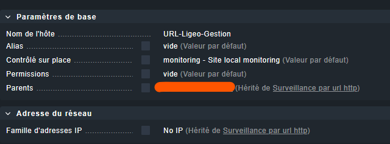
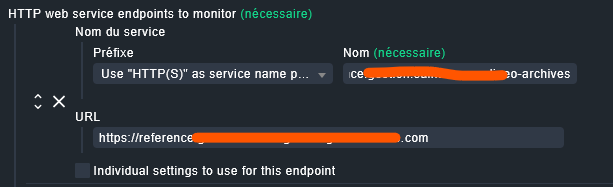
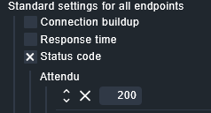
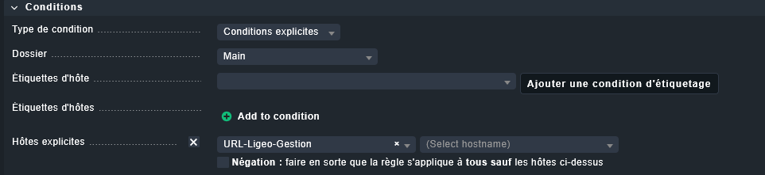
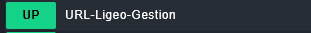

# Procédure : Supervision de l'URL Ligeo Gestion dans Checkmk

Cette procédure détaille la création de l'hôte et la configuration de la règle `Check HTTP web service` pour l'application **Ligeo Gestion**, conformément aux recommandations du service informatique.

---

## 📌 Informations sur le service

* **Application :** Ligeo (Module Gestion)
* **Éditeur :** Boscop
* **Type d'hôte :** Application Web / URL
* **Protocole :** HTTPS (Port 443)

---

## 🛠️ Étapes de configuration

### Étape 1 : Création de l'hôte dédié à l'URL

1. Dans Checkmk, allez dans le menu **Configuration** (*Setup*) > **Hôtes** (*Hosts*) > **Ajouter un hôte** (*Add host*) dans le dossier `Surveillance par url http`.
2. Dans **Paramètres de base**, renseignez le nom :
   * **Nom de l'hôte :** `URL-Ligeo-Gestion`
3. Les paramètres réseau (`No IP`) et les étiquettes (`host:NoPing`) sont automatiquement hérités du dossier parent.
4. Cliquez sur **Sauvegarder et quitter** .

---

### Étape 2 : Configuration de la règle de contrôle HTTP

1. Allez dans **Configuration** (*Setup*) > **Services** > **HTTP, TCP, Email, ...**
2. Dans la section **Networking**, cliquez sur **Check HTTP web service**.
3. Cliquez sur **Créer une règle dans le dossier** (*Create rule in folder* / *Add rule*).
4. Dans la section **Valeur** (*Value*) > **HTTP web service endpoints to monitor** :
   * **Prefix :** Laissez `Use "HTTP(S)" as service name prefix`
   * **Nom du service :** Saisissez le nom de domaine (ex: `reference.gestion...ligeo-archives.com`)
   * **URL :** Renseignez l'URL complète avec le protocole HTTPS :  
     `https://reference.gestion...ligeo-archives.com`
     

5. Dans la section **Standard settings for all endpoints** :
   * Cochez **Status code**.
  
     
      
> **Pourquoi vérifier le Status Code plutôt qu'un simple ping ?**  
> Un serveur peut être joignable sur le réseau tout en renvoyant une erreur web (ex: *500 Erreur interne* ou *404 Introuvable*). Tester le code de statut HTTP garantit que l'application web sous-jacente est réellement en ligne et fonctionnelle pour les utilisateurs.
   * Dans **Expected**, renseignez **`200`**.

 > 
> **Pourquoi le code `200` ?**  
> Lorsqu'un serveur web répond correctement, il renvoie le code **`200 OK`**. En activant cette option, on demande à Checkmk de vérifier que l'URL répond avec ce code spécifique. 
> * Si la page répond `200`, la supervision passe au **VERT (OK)**.
> * Si la page renvoie une erreur (ex: `404` *Non trouvé* ou `500` *Erreur serveur*), Checkmk bascule immédiatement au **ROUGE (CRITICAL)**.

6. Dans la section **Conditions** (en bas de page) :
   * Cochez la case **Hôtes explicites**.
   * Sélectionnez l'hôte créé à l'étape 1 : `URL-Ligeo-Gestion`.

   

---

### Étape 3 : Validation et Déploiement

1. Cliquez sur **Enregistrer** (*Save*) en haut à gauche.
2. Cliquez sur l'icône jaune **Modifications en attente** (*Pending Changes*) en haut à droite, puis sur **Activer sur les sites sélectionnés** (*Activate on selected sites*).
3. Rendez-vous dans la vue de l'hôte pour vérifier que le service web remonte bien au statut **OK** (Vert).
   
