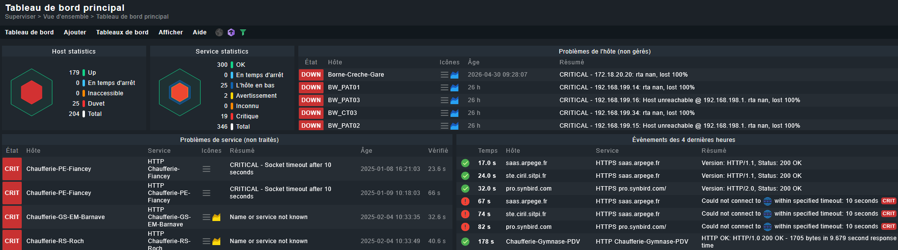

## 1. Présentation du projet

La mairie gère une infrastructure informatique hétérogène répartie sur de nombreux sites distants (Hôtel de Ville, écoles, gymnases, services techniques).

L'objectif de ce projet est de **centraliser, maintenir à jour et piloter la supervision** de l'ensemble du parc afin de :

- Garantir la continuité du service public
- Anticiper les pannes matérielles ou réseau
- Fiabiliser l'inventaire des équipements supervisés

L'outil retenu est **Checkmk Raw Edition (CRE)**, déployé sur un serveur Linux local nommé `monitoring`. À ce jour, **204 hôtes** sont enregistrés dans la solution, un chiffre amené à évoluer au fil des mises en production et des retraits de matériel.

> [!NOTE]
> Checkmk Raw Edition (CRE) est la version open source gratuite de Checkmk. Elle offre toutes les fonctionnalités essentielles de supervision sans licence commerciale, ce qui la rend adaptée au contexte d'une collectivité territoriale.

